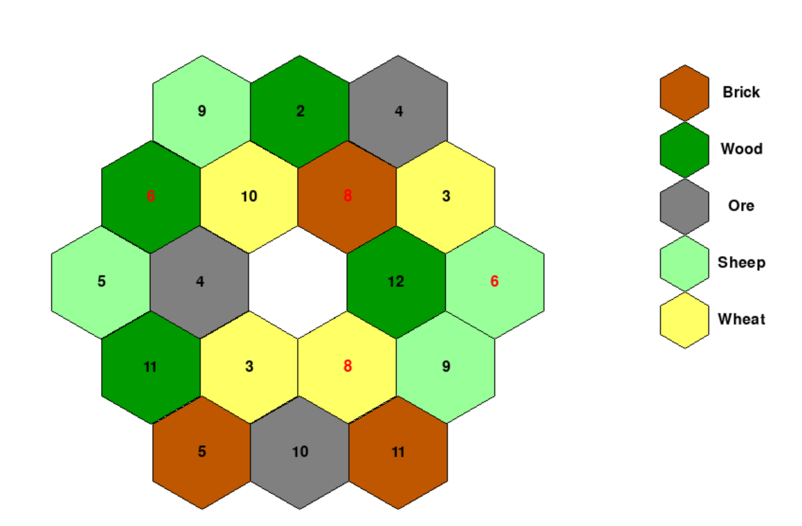

# Catan Board Generator
This script creates an optimal board layout for the default version of the game Settelers of Catan. 
It follows a few simple rules such that no area on the board will be overpowered. 

## Rules 
1. No two Brick or Ore tiles can be adjacent.
2. 6s and 8s cannot be adjacnet to other 6s or 8s.
3. No adjacent tiles can have the same number.
4. No 3 Sheep, Wheat, or Wood tiles can be adjacent. (includes adjacent of adjcaent tiles)
5. No 6s or 8s on the same resource.

Using the pygame module in python this also draws the board granting a visual aid when setting up your board at home. The board is comprised of 19 tiles split into 5 rows. The hexagons are orientated in pointed top which is important when dealing with adjacency.

## Generated Board

